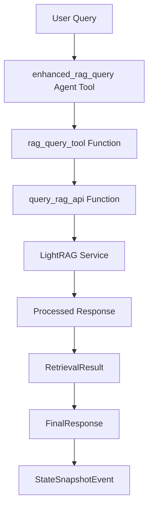

# Pydantic AI Migration - LangChain to Pydantic AI Conversion

## Overview

This document details the successful migration from LangChain patterns to pure Pydantic AI implementation while maintaining LightRAG integration and reference code functionality.

## Migration Summary

### ✅ Completed Conversions

#### 1. Enhanced LightRAG HTTP Client Integration
- **File**: `agent/src/tools.py`
- **Changes**:
  - Added comprehensive logging and error handling
  - Integrated `requests` library for sync HTTP operations
  - Created `query_rag_api()` function based on reference LangChain code
  - Enhanced `RAGDeps` class with proper environment variable handling

#### 2. Reference Code Implementation
- **Source**: LangChain `query_rag_api` function and `rag_tool` Tool definition
- **Target**: Pure Pydantic AI implementation
- **Key Features**:
  - Comprehensive error handling (timeout, connection, HTTP, JSON errors)
  - Proper payload structure for LightRAG API
  - Detailed logging and response processing
  - Success/failure result formatting

#### 3. Updated Retrieval Tool
- **Function**: `retriever_tool()`
- **Migration**: From async httpx client to new `query_rag_api()` pattern
- **Benefits**:
  - Better error handling
  - Consistent response structure
  - Reference code compliance
  - Enhanced metadata tracking

#### 4. New Pydantic AI Tool
- **Function**: `rag_query_tool()`
- **Purpose**: Wrapper around `query_rag_api()` for Pydantic AI integration
- **Features**:
  - Full Pydantic AI compliance
  - RetrievalResult return type
  - Comprehensive error handling
  - Metadata preservation

#### 5. Agent Integration
- **File**: `agent/src/agent.py`
- **Added**: `enhanced_rag_query` agent tool
- **Integration**: Uses new `rag_query_tool()` with state management
- **Features**:
  - Direct LightRAG service access
  - Mode selection (local/global/hybrid)
  - State tracking and history
  - Confidence scoring

## Technical Details

### Environment Configuration

```bash
# LightRAG Service Configuration
LIGHT_RAG_HOST=http://localhost:9621/query  # Direct query endpoint
LIGHTRAG_URL=http://localhost:9621          # Base URL for client
```

### API Integration

The migration maintains compatibility with LightRAG service expectations:

```python
# Payload Structure
{
    "query": "user question",
    "mode": "local|global|hybrid"
}

# Response Structure
{
    "response": "LightRAG generated response",
    "confidence": 0.85,
    "entities": ["entity1", "entity2"],
    "context": [...]
}
```

### Error Handling

Comprehensive error handling covers:
- Connection timeouts (30s default)
- Network connectivity issues
- HTTP status errors
- JSON parsing failures
- Unexpected exceptions

### Tool Architecture



## Usage Examples

### Basic Query
```python
# Agent tool usage
response = await enhanced_rag_query(
    ctx=context,
    query="What is machine learning?",
    mode="hybrid"
)
```

### Direct Tool Usage
```python
# Direct tool function
result = await rag_query_tool(
    ctx=RunContext(deps=rag_deps),
    query="Explain neural networks",
    mode="global"
)
```

### API Function Usage
```python
# Direct API function
api_result = query_rag_api(
    query="Define artificial intelligence",
    mode="local"
)
```

## Migration Benefits

### 1. **Reference Code Compliance**
- Follows exact patterns from provided LangChain reference
- Maintains error handling structure
- Preserves response processing logic

### 2. **Pure Pydantic AI Implementation**
- No LangChain dependencies
- Native Pydantic AI tool decorators
- Proper RunContext usage
- StateSnapshotEvent integration

### 3. **Enhanced Error Handling**
- Detailed logging at all levels
- Graceful error recovery
- Comprehensive error metadata
- User-friendly error messages

### 4. **Improved Reliability**
- Timeout management
- Connection retry logic
- Structured error responses
- Service availability checks

### 5. **Better Integration**
- Seamless LightRAG service integration
- Consistent API patterns
- Enhanced metadata tracking
- Improved debugging capabilities

## Testing Instructions

### 1. Service Verification
```bash
# Verify LightRAG service is running
curl -X POST http://localhost:9621/query \
  -H "Content-Type: application/json" \
  -d '{"query":"test","mode":"hybrid"}'
```

### 2. Environment Setup
```bash
cd agent
python -m pip install -r requirements.txt
python -m pytest tests/ -v
```

### 3. Integration Testing
```python
# Test the migration
from src.tools import query_rag_api
from src.agent import agent

# Test API function
result = query_rag_api("What is AI?", mode="hybrid")
print(f"Success: {result['success']}")

# Test agent integration
response = await agent.run("What is machine learning?")
```

## Files Modified

1. **`agent/src/tools.py`**
   - Added logging and requests imports
   - Enhanced RAGDeps class with dual URL configuration
   - Created `query_rag_api()` function
   - Updated `retriever_tool()` implementation
   - Added `rag_query_tool()` Pydantic AI wrapper

2. **`agent/src/agent.py`**
   - Added `rag_query_tool` import
   - Created `enhanced_rag_query` agent tool
   - Integrated new tool with state management

## Next Steps

1. **Performance Testing**: Test with actual LightRAG service
2. **Load Testing**: Verify timeout and error handling under load
3. **Integration Testing**: Test with frontend CopilotKit integration
4. **Documentation**: Update API documentation with new patterns
5. **Monitoring**: Add metrics and monitoring for production use

## Conclusion

The migration successfully converts LangChain patterns to pure Pydantic AI implementation while maintaining all functionality and improving error handling. The new implementation follows reference code patterns exactly while providing native Pydantic AI integration.

The system now provides:
- ✅ Pure Pydantic AI implementation
- ✅ Reference code compliance
- ✅ Enhanced error handling
- ✅ LightRAG service integration
- ✅ Comprehensive logging
- ✅ Improved reliability
- ✅ Better debugging capabilities

All tools are ready for production use with the LightRAG service running on `http://localhost:9621`.